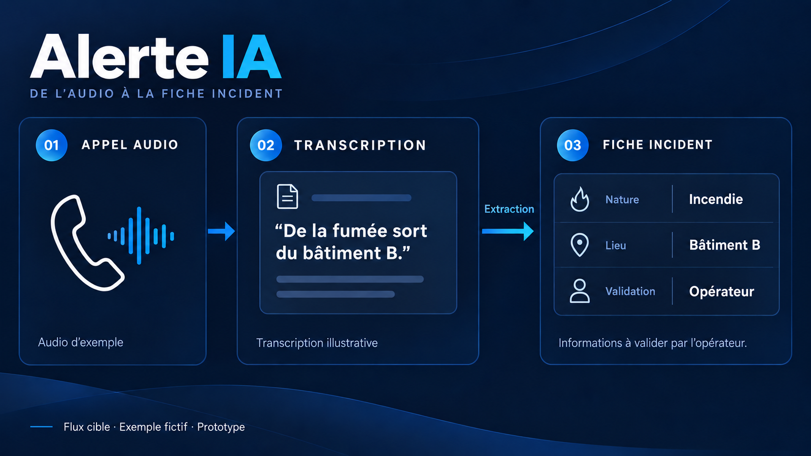

# Rayan Terki

**Software Developer | Python, C# & TypeScript | Full-Stack & Applied AI**

Based in Canada. I build web applications, backend APIs and software tools that connect data, models and user workflows.

## Selected projects

### [LIDAL Pulse](https://github.com/rayantr06/LIDALPulse)

A collaborative marketing intelligence application. My engineering work connects Python/FastAPI services, React/TypeScript interfaces, multilingual NLP workflows and language-model integration.

### [OuiAgent](https://ouiagent.com)

A bilingual marketplace connecting clients with independent security agents. I contribute to the Next.js/React/TypeScript application, including agent discovery, booking and account workflows.

### [Alerte IA](https://github.com/rayantr06/alerte-ia-prototype)

Software development for a collaborative emergency-call research prototype: collection and annotation tools, model integration, and an operator interface for transcription and structured incident information. The application combines a FastAPI backend with a Next.js/TypeScript frontend.

### [Safar](https://github.com/rayantr06/safar)

A collaborative travel and booking platform with client, partner and admin interfaces. My contributions include authentication routes and fixes to partner booking rendering.

## More work

### [Let-Data-DZ](https://let-data-dz.dev)

Audio collection workflows using HTML/CSS/JavaScript, browser recording and Apps Script integration with Drive and Sheets.

### [Golf Tournament Management](https://github.com/khenteurhanane/Gestion_Tournoi_Golf_G06)

Team ASP.NET Core MVC application. My contributions include interface improvements, database query fixes, integration tests and PostgreSQL deployment adjustments.

## Technologies

- **Backend:** Python, FastAPI, C#, ASP.NET Core
- **Frontend:** TypeScript, JavaScript, React, Next.js, HTML/CSS
- **Data:** SQL, PostgreSQL, SQLite, Entity Framework Core
- **Quality:** pytest, xUnit, Playwright, integration tests
- **Applied AI:** NLP, speech processing and model integration

I'm interested in backend, full-stack and applied AI software development roles in Canada.

[LinkedIn](https://www.linkedin.com/in/rayan-terki/)
